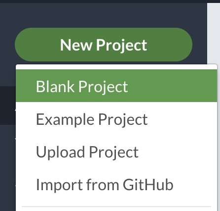
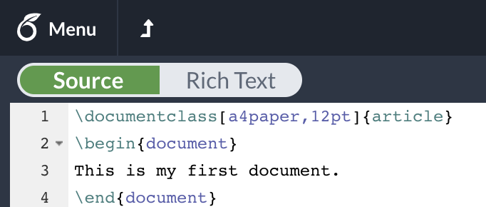
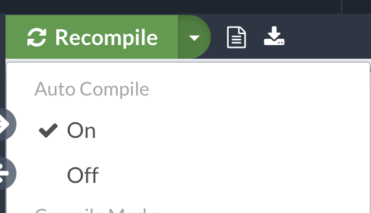
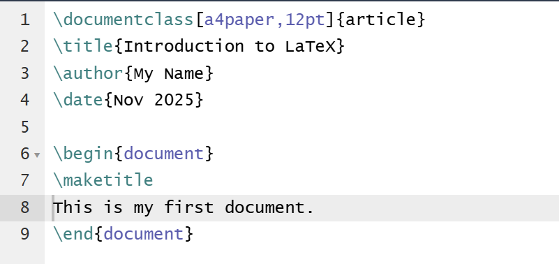
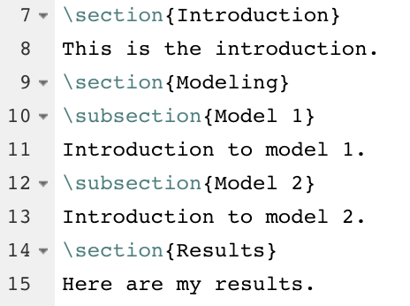
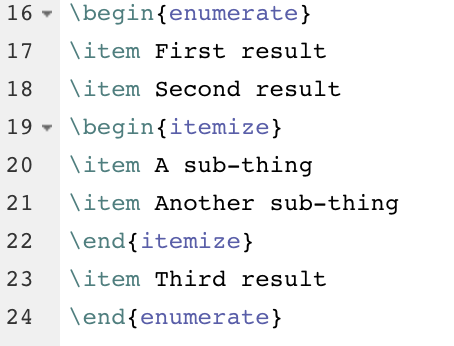
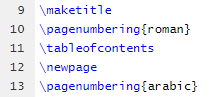
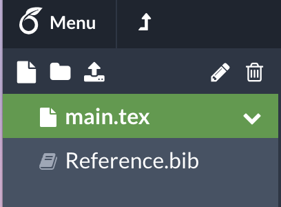

# Creating Your First Document

If you and your group have any questions or get stuck as you work through this in-class exercise, please ask the instructor for assistance. Have fun!

1.  **Go to [https://www.overleaf.com/](https://www.overleaf.com/){:target="_blank"} and log into your account.**
2.  **Create a new project and choose the first one (Blank project)**
3.  **Replace the original text with the following:**

    ```
    \documentclass[a4paper,12pt]{article}
    \begin{document}
    This is my first document.
    \end{document}
    ```
    
    
    
    
    
    For the rest of this activity, make sure that all the content of your document stays in between `\begin{document}` and `\end{document}`.
    Note: You can always preview the file on the rightmost window. If you want to, enable "Auto Compile"

4.  **Create a Title**<br>
    Insert the following after the `\begin{document}` command:
    
    ```
    \title{Introduction to LaTeX}
    \author{My Name}
    \date{\today}
    \maketitle
    ```
    
    You can also customize the data by typing `\date{Dec 2021}`
    
    
    
5.  **Add section and subsections**<br>
    Replace “This is my first document” with the following:
    
    ```
    \section{Introduction}
    This is the introduction
    \section{Modeling}
    \subsection{Model 1}
    Introduction to model 1.
    \subsection{Model 2}
    Introduction to model 2.
    \section{Results}
    Here are my results.
    ```
    
    

6.  **Produce a list of items in the "Results" section after "Here are my results."**
    
    ```
    \begin{enumerate}
    \item First result
    \item Second result
    \begin{itemize}
    \item A sub-thing
    \item Another sub-thing
    \end{itemize}
    \item Third result
    \end{enumerate}
    ```
    
    

7.  **Create a table of contents**<br>
    Insert the following directly after `\maketitle`
    
    ```
    \pagenumbering{roman}
    \tableofcontents
    \newpage
    \pagenumbering{arabic}
    ```
    
    

8.  **Inserting References**<br>
    Download ([https://goo.gl/E9m6S7](https://goo.gl/E9m6S7){:target="_blank"}) and upload the BibTeX file to Overleaf. In the main.tex file, type the following:
    
    ```
    See \cite{DUMMY:1} for more proof details.
    \newpage
    \bibliography{Reference}
    \bibliographystyle{ieeetr}
    ```
    You can add more references in the "Reference.bib" file.
    
    
    
9.  **Download PDF and share the LaTeX file**<br>
    You can download the PDF file by clicking the "Download PDF" button at the top of your compiled LaTeX page. You can also invite others to edit your file by clicking the "SHARE" button at the top right of your screen.

[NEXT STEP: Inserting Tables and Figures](act-2.html){: .btn .btn-blue }
