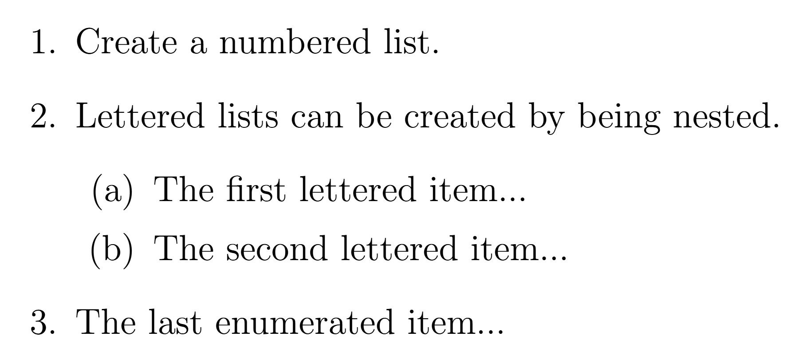
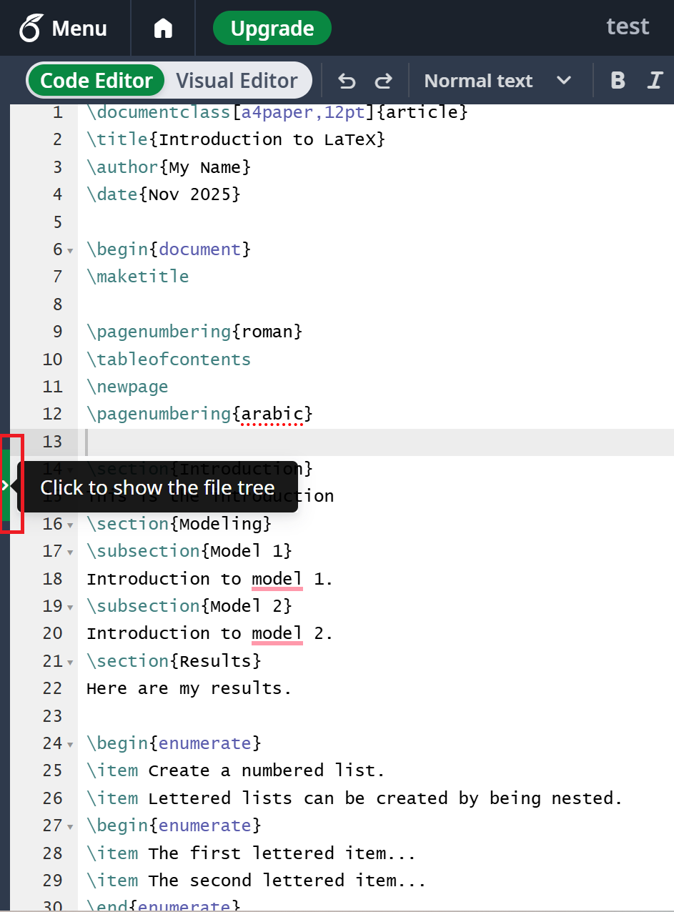

# Creating Your First Document


If you and your group have any questions or get stuck as you work through this in-class exercise, please ask the instructor for assistance. Have fun!

1.  **Go to [https://www.overleaf.com/](https://www.overleaf.com/){:target="_blank"} and log into your account.**
2.  **Create a new project and choose the first one (Blank project)**
3.  **Replace the original text with the following:**

    ```
    \documentclass[a4paper,12pt]{article}
    \begin{document}
    This is my first document.
    \end{document}
    ```
    
    
    
    
    
    Note: You can always preview the file on the rightmost window. If you want to, enable "Auto Compile".  You can also use the keyboard shortcut **Ctrl+s** (**Cmd+s** on mac) to compile.

    As you go through these activities, make sure you pay attention to how the compiled file is changing according to the code you wrote in the code editor.

5.  **Create a Title**<br>

    To create a title, you should add a few more pieces of information in the preamble.
    After `\documentclass` but before `\begin{document}`, add the following:
    
    ```
    \title{Introduction to LaTeX}
    \author{My Name}
    \date{\today}
    ```

    Note: You can also customize the data by typing `\date{Dec 2042}`.
    
    This provides LaTex with the information needed to make a title, but it does not add the title to the document. To do that, you need to add a line after `\begin{document}`:

    ```
    \begin{document}
    \maketitle
    This is my first document.
    \end{document}
    ```
    
    
    
6.  **Add sections and subsections**<br>
    After `\maketitle` but before  `\end{document}` insert the following:
    
    ```
    \section{Introduction}
    This is the introduction
    \section{Modeling}
    \subsection{Model 1}
    Introduction to model 1.
    \subsection{Model 2}
    Introduction to model 2.
    \section{Results}
    Here are my results.
    ```
    
    

7.  **Produce a list of items in the "Results" section after "Here are my results."**
    
    ```
    \begin{enumerate}
    \item First result
    \item Second result
    \begin{itemize}
    \item A sub-thing
    \item Another sub-thing
    \end{itemize}
    \item Third result
    \end{enumerate}
    ```
    
    

8.  **Create a nested list**<br>
    Notice the differences between the first list that used `{itemize}` and the second list that used nesting.

    ```
    \begin{enumerate}
    \item Create a numbered list.
    \item Lettered lists can be created by being nested.
    \begin{enumerate}
    \item The first lettered item...
    \item The second lettered item...
    \end{enumerate}
    \item The last enumerated item...
    \end{enumerate}
    ```
    
    

7.  **Create a table of contents**<br>
    Insert the following directly after `\maketitle`. This sets roman numbering for the first page, where you add a table of contents. Then the `\newpage` command creates a new page, where page numbering is set using arabic numbers.
    
    ```
    \pagenumbering{roman}
    \tableofcontents
    \newpage
    \pagenumbering{arabic}
    ```
    
    

8.  **Inserting References**<br>
    Download [this file](docs/Reference.bib){:target="_blank"} and upload the BibTeX file to Overleaf.

    To upload it to Overleaf, first open the left-hand menu to display the file tree. It might be hidden, so click the little arrow on the right to open the file tree, as shown here:
    

Then, click on the upload icon  and select the fiel for upload.

    In the main.tex file, type the following between `\end{enumerate}` and `\end{document}`:
    
    ```
    See \cite{DUMMY:1} for more proof details.
    \newpage
    \bibliography{Reference}
    \bibliographystyle{ieeetr}
    ```
    You can add more references in the "Reference.bib" file.
    
    
    
10.  **Download PDF and share the LaTeX file**<br>
    You can download the PDF file by clicking the "Download PDF" button at the top of your compiled LaTeX page. You can also invite others to edit your file by clicking the "SHARE" button at the top right of your screen.

[NEXT STEP: Inserting Tables and Figures](act-2.html){: .btn .btn-blue }
