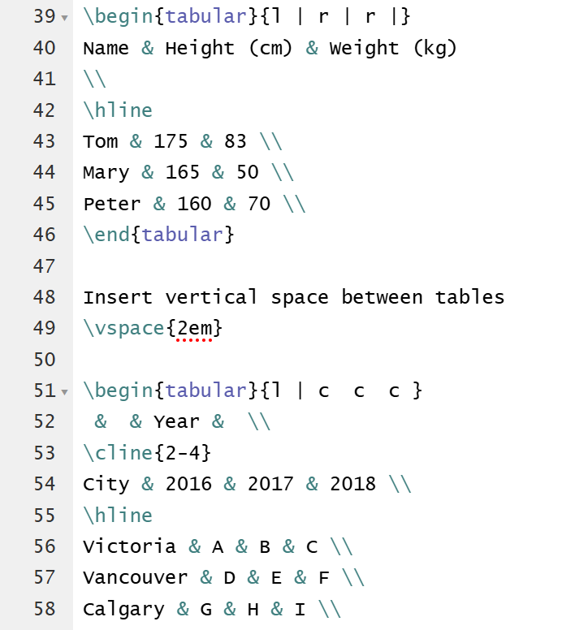
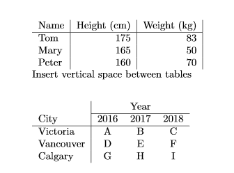
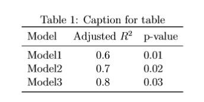
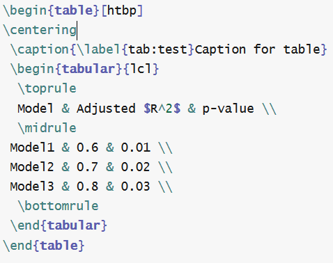
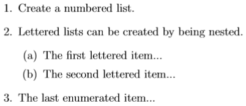
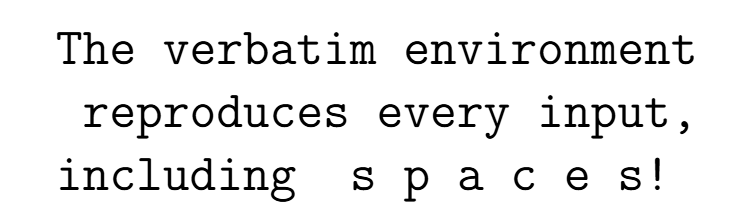

# Inserting Tables and Figures

If you and your group have any questions, or get stuck as you work through this in-class exercise, please ask the instructor for assistance. Have fun!



1.  **Using Chapter 4 (pg. 17-18) [https://goo.gl/MFp45A](https://goo.gl/MFp45A){:target="_blank"} for reference, write code to produce the tables below:**

    

2.  **Insert and refer figures**<br>
    Download the figure first: [https://goo.gl/YH3R4n](https://goo.gl/YH3R4n){:target="_blank"}. Upload the picture by clicking “PROJECT” on the top of the page, and then “Files... → Computer”. Then, type `\usepackage{graphicx}` directly after the `\documentclass[a4paper,12pt]{article}` and above the `\begin{document}`. Type the following codes below the `\begin{document}` :-) <br>
    
    
    
    Insert a figure:

    ```
    \begin{figure}[h!]
    \centering
    \includegraphics[width=1\textwidth]{uvic.png}
    \caption{This is caption}
    \label{fig:uvic}
    \end{figure}
    ```
    Type the following to refer the figure.
    Example: `Please see Figure~\ref{fig:uvic}`.

3.  **Create a three-line table (research paper style)**<br>
    
    
    
    First type: `\usepackage{booktabs}` after `\usepackage{graphicx}` after the \documentclass[a4paper,12pt]{article} and above the \begin{document}. Then type the following codes below the \begin{document}:

    

    ```
    \begin{table}[htbp]
    \centering
     \caption{\label{tab:test}Caption for table}
     \begin{tabular}{lcl} 
      \toprule
      Model & Adjusted $R^2$ & p-value \\
      \midrule
     Model1 & 0.6 & 0.01 \\
     Model2 & 0.7 & 0.02 \\
     Model3 & 0.8 & 0.03 \\
      \bottomrule
     \end{tabular}
    \end{table}
    ```

    **Note:** in the \begin{tabular}{lcl}, it should type the "**l**" (in short for left) rather than digital number 1 and ‘c’ (in short for center).  {lcl} is used for the column alignment in the table. There are three options for column alignment, namely l (left), c (center) and r (right). You can change this part as you like.

4.  **Refer the table**<br>
    Type the following in your paragraph to refer the table: 
    `Please see Table~\ref{tab:test}.`

5.  **Inserting footnote to the document**<br>
    Type the following:
    `This is the footnote.\footnote{Footnote text.}`

6.  **Creating enumerated and nested lists**<br>
    
    
    
    Note: please insert the following codes into your main body, which means that it should be below the \begin{document} but above the \end{document}.

    ```
    \begin{enumerate}
    \item Create a numbered list.
    \item Lettered lists can be created by being nested.
    \begin{enumerate}
    \item The first lettered item...
    \item The second lettered item...
    \end{enumerate}
    \item The last enumerated item...
    \end{enumerate}
    ```

7.  **Text formatting in LaTex**

    

    ```
    Type Quote: Single `Quote', Double ``Quotes''
    \begin{verbatim}
    The verbatim environment
     reproduces every input,
    including  s p a c e s!
    \end{verbatim}
    ```

[NEXT STEP: Typing Math Equations](act-3.html){: .btn .btn-blue }
