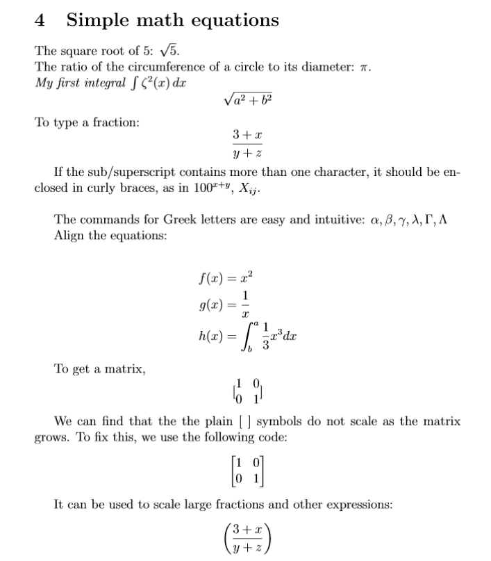
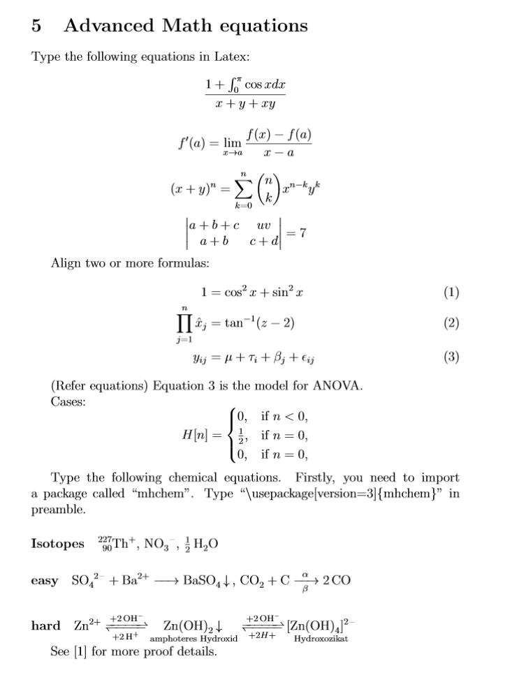

# Typing Math Equations
If you and your group have any questions, or get stuck as you work through this in-class exercise, please ask the instructor for assistance. Have fun!

Try to produce the following equations in LaTeX. Use [this](https://www.overleaf.com/learn/latex/Mathematical_expressions){:target="_blank"} as a guide. Check your solutions in Activity #4.

[NEXT STEP: Solutions](act-4.html){: .btn .btn-blue }
