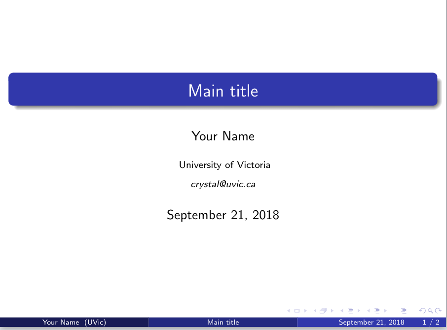
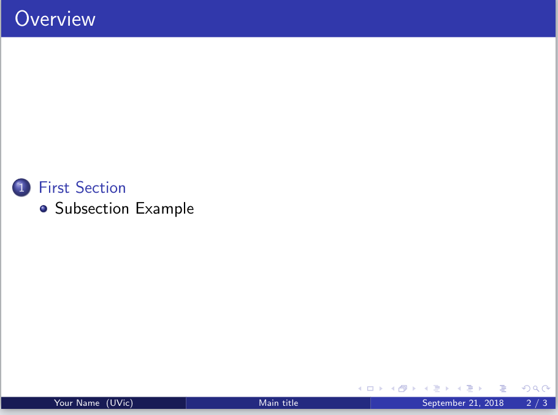
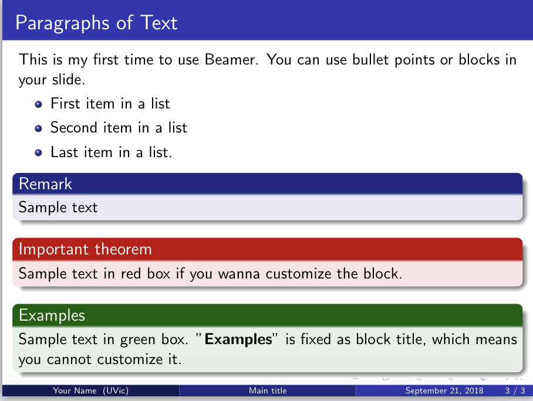

# Presentations With Beamer
If you and your group have any questions, or get stuck as you work through this in-class exercise, please ask the instructor for assistance. Have fun!

Beamer is a LaTeX class for making presentation slides. Let’s create a new project for this activity in Overleaf.

1.  **Create a new project and choose the first one (Blank paper)**
2.  **Replace the original text with the following to set up your title page:**

    ```
    \documentclass[pdf]{beamer}
    \mode<presentation>{}
    \usetheme{Madrid}        
    % title page
    \title{Main title}
    \author{Your Name}
    \institute[UVic]
    {University of Victoria \\
    \medskip
    \textit{crystal@uvic.ca} % Your email 
    }
    \date{\today}  % it can be customized
    ```

    

3.  **Create your overview page and start your work:**

    ```
    \begin{document}
    \begin{frame}
    \titlepage % Print the title page as the first slide
    \end{frame}
    \begin{frame}
    \frametitle{Overview}   % Table of contents slide, comment this block out to remove it
    \tableofcontents            
    \end{frame}
    \end{document}
    ```

    

4.  **Change the theme for slides:**<br>
    Find the code `\mode<presentation>{}` (In the very beginning).  There are other themes like `\usetheme{CambridgeUS}`

5.  **Create the main body of the slides:**<br>
    Type the following directly before the `\end{document}`

    ```
    \begin{frame}
    \frametitle{Paragraphs of Text}
    This is my first time using Beamer. 
    You can use bullet points or blocks in your slide.
    \begin{itemize}
    \item First item in a list
    \item Second item in a list 
    \item Last item in a list.
    \end{itemize}
    \begin{block}{Remark}
    Sample text
    \end{block}
    \begin{alertblock}{Important theorem}
    Sample text in red box if you wanna customize the block.
    \end{alertblock}
    \begin{examples}
    Sample text in green box. "\textbf{Examples}" is fixed as block title, 
    which means you cannot customize it.
    \end{examples}
    \end{frame}
    ```

    Now go back to your content pages, it has automatically updated as below.

    

6.  **Discover your own preferred template!**<br>
    [https://goo.gl/VUn4Xq](https://goo.gl/VUn4Xq){:target="_blank"}

[NEXT STEP: Earn a Workshop Badge](informal-credentials.html){: .btn .btn-blue }
