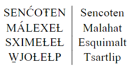

# Advanced Fonts with XeLaTeX
If you and your group have any questions, or get stuck as you work through this in-class exercise, please ask the instructor for assistance. Have fun!

XeLaTeX is an alternative compiler to regular LaTeX that supports Unicode text and other modern font formats.

Let’s create a new project for this activity in Overleaf.

1.  **Create a new project in Overleaf and choose the first one (Blank paper)**

    

2.  **Change compiler**. Click the top left **Menu** button, scroll down to Settings, click the drop down next to Compiler, then select **XeLaTeX**.

    

3.  **Replace the original text with the following to set up your title page:**

    ```
    \documentclass[pdf]{article}
    \usepackage{fontspec}       
    \setmainfont{Times New Roman}
    \setsansfont{Arial}
    \setmonofont[Color={4CA6A6}] {Courier New} %4CA6A6 is the hex code for teal.
    \title{Fun with Fonts}
    \author{Your name here}
    \date{\today}
   
    \begin{document}
    \maketitle

    \end{document}
    ```

    

4. **Change the font**
    -   Add text in a different font by typing it inside curly brackets.  Copy and paste the below line between your ```\maketitle``` and ```\end{document}```statements.
    ```
    This is the default font, Times New Roman.
    \sffamily Here is some text in Arial, a sans serif family font.
    \ttfamily Here is some teal text in Courier New, a mono font. 
    \rmfamily Set back to times new roman
    ```
    

5. **Add a font package for Japanese, Chinese, or Korean**
    -   Add ```\usepackage{xeCJK}``` to the top of the file with the other ```\usepackage``` statements.
    -   Add ```\setCJKmainfont{IPAMincho}``` below the other font statements
    -   Go to [Google Translate](https://translate.google.com/){:target="_blank"} and translate a phrase from English to Japanese
    -   Copy the Japanese translation into your overleaf document.
    -   Re-compile - you should now see the Japanese text in the pdf.

    

6. **Add a font from outside Overleaf**  
    
    -   Go to [Google Fonts](https://fonts.google.com/specimen/Asap){:target="_blank"}  and download the Asap font family files by clicking the **Download Family** button on the top right.
     
    -  Click the top left **folder icon** to make a new folder in Overleaf. Name the folder **AsapFontFiles.** _Note: the folder name is case sensitive!_
    -  Upload the font files into your new folder using the **Upload** button on the top left.
    -  Copy and paste into your document:

    ```

    \setsansfont{Asap}[
        Path=./AsapFontFiles/,
        Scale=0.9,
        Extension = .ttf,
        UprightFont=*-Regular,
        BoldFont=*-Bold,
        ItalicFont=*-Italic,
        BoldItalicFont=*-BoldItalic
    ]
    ```
    - Try writing some text in the Asap font:
    ```\sffamily Now we can type in asap! The Quick Brown Fox Jumps Over the Lazy Dog```
    

7. **Add a Unicode font**   
    -   In the top of the document, replace ```\setmainfont{Times New Roman}``` with ```\setmainfont{Doulos SIL}``` 
    -   Doulos SIL is a [Unicode](https://en.wikipedia.org/wiki/Unicode){:target="_blank"} font family.  Now you can use unicode characters in your LaTeX document!
    -   Type some IPA (International Phonetic Alphabet) characters using [this browser IPA keyboard](https://keymanweb.com/#und-fonipa,Keyboard_sil_ipa){:target="_blank"} and [this reference guide](https://help.keyman.com/keyboard/sil_ipa/1.8.6/sil_ipa){:target="_blank"}, then copy and paste them into your Overleaf document.
        -  _If you have a unicode keyboard installed on your computer, you can type directly in your Overleaf document_.
    -   Type out these [Sencoten](https://www.languagegeek.com/salishan/sencoten.html){:target="_blank"} words using the [Sencoten Keyboard](https://keyman.com/keyboards/fv_sencoten){:target="_blank"}, then copy-paste them into a table like the image below.
        -   _Hint: use ' to add top accent, - for dash accent and = for low line accent._

        

    <button onclick="toggle('sol')">**Show/Hide Solution**</button>
    <div id="sol" style="display: none">
    In the keyboard: ```SENC'OT-EN, MA'LEXEL-, SXIMEL-EL-, W=JOL-EL-P```. 

    In Overleaf:

    
    </div>
        

        

8. **OPTIONAL: Using Tipa, a phonetic alphabet font**
    -   Tipa is an older way to type IPA in LaTeX - you can skip this part of the activity if you like.
    -   Make a new folder called **TipaFontFiles**
    -   Download the [tipa font files](https://ctan.org/tex-archive/fonts/tipa/tipa/type1){:target="_blank"} 
    -   Tipa has a lot of different font options, but to keep things simple upload roman (tipa8), bold (tipab10), italic (tipasl8), and bold italic (tipasb10) to your new folder.
    -  Copy and paste:
    ```
    \setsansfont{tipa}[
    Path=./TipaFontFiles/,
    Scale=0.9,
    Extension = .pfb,
    UprightFont=*8,
    BoldFont=*b10,
    ItalicFont=*sl8,
    BoldItalicFont=*sb10
    ]
    ```
    - Use [pages 14 and 36-56 of the Tipa manual](https://muug.ca/mirror/ctan/fonts/tipa/tipa/doc/tipaman.pdf){:target="_blank"}  to type up some phonetic symbols.
    - Try to write out the IPA pronunciation for Lekwungen:
    
    - Solution: 
    ```\sffamily l@\textvbaraccent{k}\textsuperscript{w}@N@n```

9.  If you want more resources, here are some helpful links:
    -   More [help on XeLaTeX]( https://www.overleaf.com/learn/latex/XeLaTeX){:target="_blank"} 
    -   More [help on font commands](https://ctan.mirror.globo.tech/macros/unicodetex/latex/fontspec/fontspec.pdf){:target="_blank"} 

**Congratulations - now you can use fonts with XeLaTeX!**

[NEXT STEP: Earn a Workshop Badge](informal-credentials.html){: .btn .btn-blue }

<script>  
    function toggle(input) {
        var x = document.getElementById(input);
        if (x.style.display === "none") {
            x.style.display = "block";
        } else {
            x.style.display = "none";
        }
    }
</script>
