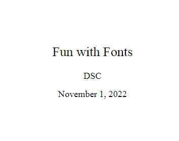
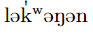

# Advanced Fonts with XeLaTeX
If you and your group have any questions, or get stuck as you work through this in-class exercise, please ask the instructor for assistance. Have fun!

XeLaTeX is an alternative compiler to regular LaTeX that supports Unicode text and other modern font formats.

Let’s create a new project for this activity in Overleaf.

1.  **Create a new project in Overleaf and choose the first one (Blank paper)**

    

2.  **Change compiler**. Click the top left **Menu** button, scroll down to Settings, click the drop down next to Compiler, then select **XeLaTeX**.

    

3.  **Replace the original text with the following to set up your title page:**

    ```
    \documentclass[pdf]{article}
    \usepackage{fontspec}       
    \setromanfont{Times New Roman}
    \setsansfont{Arial}
    \title{Fun with Fonts}
    \author{Your name here}
    \date{\today}
   
    \begin{document}
    \maketitle

    \end{document}
    ```

    
4. **Change the font**
    -   Add text in a different font by typing it inside curly brackets.  Copy and paste the below line somewhere between your ```\begin{document}``` and ```\end{document}```statements.
    ```
    {\sffamily Here is some text in Arial, a sans serif family font.}\\
    {\rmfamily Here is some text in Times New roman, a serif font.}
    ```

5. **Add a font package for Japanese, Chinese, or Korean**
    -   Add ```\usepackage{xeCJK}``` to the top of the file
    -   Add ```\setCJKmainfont{IPAMincho}``` below the other font statements
    -   Go to [Google Translate](https://translate.google.com/){:target="_blank"} and translate a phrase from English to Japanese
    -   Copy the Japanese translation into your overleaf document.
    -   Re-compile - you should now see the Japanese text in the pdf.

     

6. **Add a font from outside Overleaf**  
    -   Go to [Google Fonts](https://fonts.google.com/specimen/Asap){:target="_blank"}  and download the Asap font family files by clicking the **Download Family** button on the top right.
        
    -  Click the top left folder icon to make a new folder in Overleaf. Name the folder "AsapFontFiles". _Note: the folder name is case sensitive!_
    -  Upload the font files into your new folder using the upload button on the top left.
    -  Copy and paste into your document:

    ```

    \setsansfont{Asap}[
        Path=./AsapFontFiles/,
        Scale=0.9,
        Extension = .ttf,
        UprightFont=*-Regular,
        BoldFont=*-Bold,
        ItalicFont=*-Italic,
        BoldItalicFont=*-BoldItalic
    ]
    ```
    - Try writing some text in the Asap font:
    ```{\sffamily Now we can type in asap! The Quick Brown Fox Jumps Over the Lazy Dog}```
    

7. **Add a Unicode font**   
    -   In the top of the document, add ```\setmainfont{Doulos SIL}```.  Notice that this will override the Times New Roman font we used earlier.
        -   _Note: in most cases you will only need one or two fonts per document, so this is normally not an issue!_
    -   Doulos SIL is a [Unicode](https://en.wikipedia.org/wiki/Unicode) font family.  Now you can use unicode characters in your LaTeX document!
    -   Type some IPA (International Phonetic Alphabet) characters [with this brower-based IPA keyboard](https://keymanweb.com/#und-fonipa,Keyboard_sil_ipa) using [this reference guide](https://help.keyman.com/keyboard/sil_ipa/1.8.6/sil_ipa), then copy and paste them into your Overleaf document. 
        -  _If you already have a unicode keyboard installed, you can use it to type directly in your Overleaf document_.

8. **OPTIONAL: Using Tipa, a phonetic alphabet font**
    -   Make a new folder called **TipaFontFiles**
    -   Download the [tipa font files](https://ctan.org/tex-archive/fonts/tipa/tipa/type1){:target="_blank"} 
    -   Tipa has a lot of different font options, but to keep things simple upload roman (tipa8), bold (tipab10), italic (tipasl8), and bold italic (tipasb10) to your new folder.
    -  Copy and paste:
    ```
    \setsansfont{tipa}[
    Path=./TipaFontFiles/,
    Scale=0.9,
    Extension = .pfb,
    UprightFont=*8,
    BoldFont=*b10,
    ItalicFont=*sl8,
    BoldItalicFont=*sb10
    ]
    ```
    - Use [pages 14 and 36-56 of the Tipa manual](https://muug.ca/mirror/ctan/fonts/tipa/tipa/doc/tipaman.pdf){:target="_blank"}  to type up some phonetic symbols.
    - Try to write out the pronunciation for the word Lekwungen:
    
    - Solution: 
    ```{\sffamily l@\textvbaraccent{k}\textsuperscript{w}@N@n}```

9.  More help on XeLaTeX: [overleaf.com/learn/latex/XeLaTeX]( https://www.overleaf.com/learn/latex/XeLaTeX){:target="_blank"} 

**Congratulations - now you know about fonts and XeLaTeX!**

[NEXT STEP: Earn a Workshop Badge](informal-credentials.html){: .btn .btn-blue }
